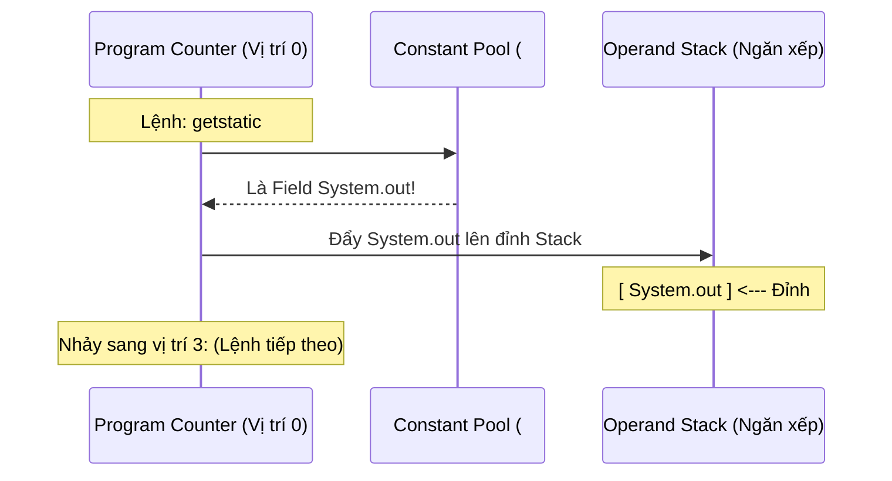
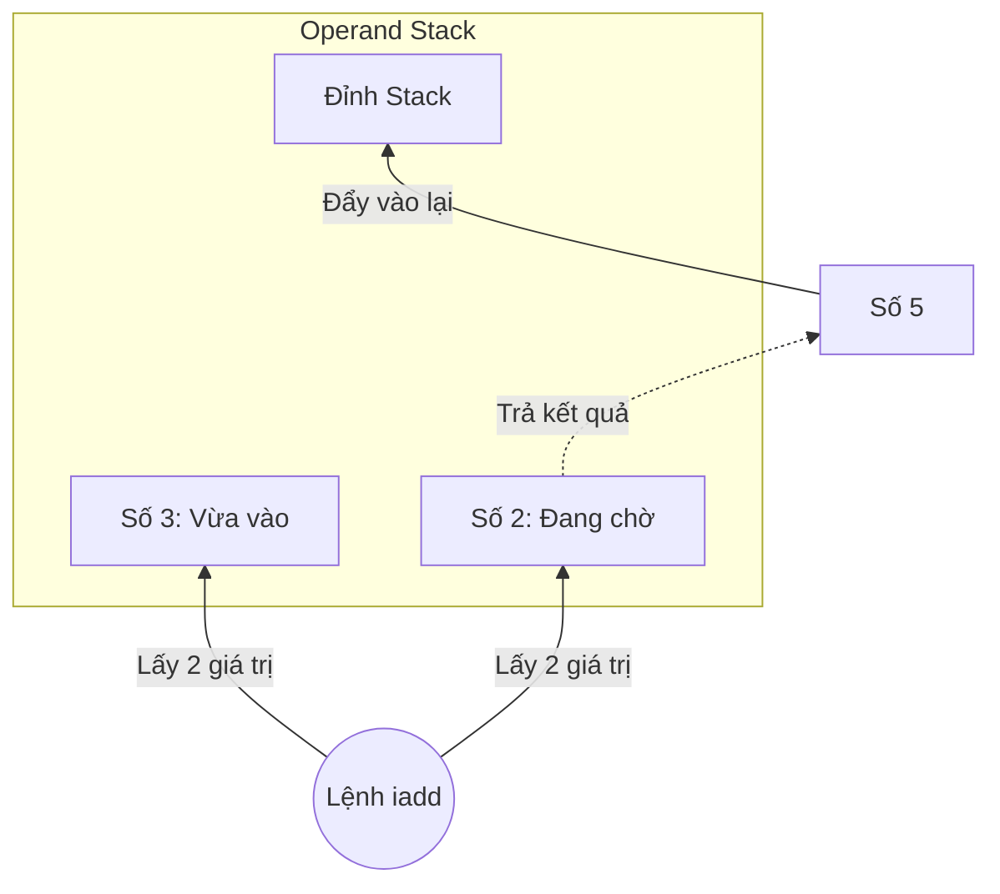

# Phân tích Chi tiết Issue #2: Custom ClassLoader & Bytecode Analysis

## 1. Cơ chế của CustomClassLoader
File: `src/main/java/com/nexus/phase1/CustomClassLoader.java`

*   **`extends ClassLoader`**: Chúng ta kế thừa lớp cha của mọi ClassLoader trong Java.
*   **`findClass(String name)`**: Đây là method quan trọng nhất. Khi ClassLoader cha (AppClassLoader) không tìm thấy class, nó sẽ gọi đến hàm này.
*   **`loadClassFromFile(name)`**: 
    1. Chuyển đổi tên class (VD: `com.nexus.SecretPlugin`) thành đường dẫn file thực tế (`.class`).
    2. Đọc file dưới dạng nhị phân (`byte[]`).
*   **`defineClass(name, b, 0, b.length)`**: Đây là "ma thuật" của JVM. Nó nhận vào một mảng byte thuần túy và biến nó thành một đối tượng `Class` sẵn sàng để sử dụng.

---

## 2. Quy trình nạp Plugin (PluginLauncher)
File: `src/main/java/com/nexus/phase1/PluginLauncher.java`

1.  **Khởi tạo Loader**: `CustomClassLoader loader = new CustomClassLoader(pluginDir)`. Trỏ ClassLoader vào thư mục "bí mật" chứa plugin.
2.  **Khám phá Class**: `Class<?> pluginClass = loader.loadClass(className)`. Lúc này JVM chưa chạy class, nó mới chỉ nạp định nghĩa của class vào vùng nhớ **Metaspace**.
3.  **Tạo Instance**: `Object instance = pluginClass.getDeclaredConstructor().newInstance()`. Sử dụng Reflection để gọi Constructor mặc định.
4.  **Ép kiểu (Cực kỳ quan trọng)**: `Plugin plugin = (Plugin) instance`.
    *   Tại sao ép kiểu được? Vì cả App và Plugin đều biết đến interface `Plugin`.
    *   Lưu ý: Nếu bạn nạp interface `Plugin` bằng 2 ClassLoader khác nhau, Java sẽ báo lỗi `ClassCastException` vì chúng được coi là 2 class khác nhau dù cùng tên.

---

## 3. Giải thích Bytecode (SecretPlugin)
Khi bạn chạy `javap -c`, đây là ý nghĩa của các dòng lệnh JVM:

### Method: `execute()`
```text
 0: getstatic     #2      // Field java/lang/System.out:Ljava/io/PrintStream;
 3: ldc           #3      // String ============================================
 5: invokevirtual #4      // Method java/io/PrintStream.println:(Ljava/lang/String;)V
```
*   **`0: getstatic #2`**: Lấy (get) một biến tĩnh (static). Ở đây là đối tượng `out` thuộc lớp `System`. Kết quả được đẩy lên đỉnh **Operand Stack**.
*   **`3: ldc #3`**: Viết tắt của "Load Constant". Nó lấy một chuỗi String từ **Constant Pool** (vùng lưu trữ hằng số trong file class) và đẩy lên stack.
*   **`5: invokevirtual #4`**: Gọi một hàm instance (không phải static). Nó sẽ lấy 2 giá trị trên stack (đối tượng `out` và chuỗi String) để thực hiện lệnh `println`.

### Giải mã: `0: getstatic #7` là gì?

Đây là cách đọc một dòng mã Bytecode đúng chuẩn kỹ thuật:

#### A. Con số `0:` (Byte Offset)
Con số đứng đầu (`0:`, `3:`, `5:`) là **vị trí (vị trí byte)** của lệnh đó trong mảng byte của phương thức.
*   **Đơn vị tính**: Bytes.
*   **Tại sao bước nhảy không đều (0, 3, 5)?**
    *   Mỗi lệnh (Opcode) có kích thước khác nhau.
    *   Lệnh `getstatic` tốn **3 bytes**: 1 byte cho lệnh `getstatic` và 2 bytes để chứa địa chỉ tham chiếu (`#7`).
    *   Vì vậy, lệnh tiếp theo (`ldc`) sẽ bắt đầu ở vị trí `0 + 3 = 3`.

#### B. Ký hiệu `#7` (Constant Pool Index)
JVM cực kỳ tiết kiệm bộ nhớ. Thay vì lưu trực tiếp chuỗi `"java/lang/System.out"` vào trong từng dòng lệnh, nó lưu tất cả vào một bảng chung gọi là **Constant Pool** (Bảng hằng số).

*   `#7` chính là **Số thứ tự (Index)** của bản ghi trong bảng đó.
*   Khi thực thi `getstatic #7`, JVM sẽ tra bảng Constant Pool tại vị trí số 7 để biết chính xác mình cần lấy biến nào.



---

## 4. Tìm hiểu về Operand Stack (Ngăn xếp toán hạng)

Mỗi phương thức (method) khi chạy sẽ được cấp một **Stack Frame**, bên trong nó chứa **Operand Stack**. Đây là "không gian nháp" để JVM thực hiện mọi phép tính.

### A. Cách hoạt động (Cơ chế LIFO - Vào sau ra trước)
JVM không dùng các thanh ghi CPU (Registers) để tính toán mà dùng Stack. Hãy xem ví dụ phép tính `2 + 3`:

| Bước | Lệnh (JVM) | Trạng thái Stack | Giải thích |
| :--- | :--- | :--- | :--- |
| 1 | `iconst_2` | `[ 2 ]` | Đẩy số hiệu 2 vào đỉnh Stack. |
| 2 | `iconst_3` | `[ 2, 3 ]` | Đẩy số hiệu 3 vào chồng lên trên số 2. |
| 3 | `iadd` | `[ 5 ]` | Lấy 2 số ra, cộng lại, rồi đẩy kết quả 5 vào lại. |
| 4 | `istore_1` | `[ ]` | Lấy số 5 ra cất vào biến cục bộ (Local Variable). |

### B. Minh họa Luồng tính toán


### C. Tại sao nó quan trọng?
Mọi lệnh gọi hàm (`invokevirtual`), lấy hằng số (`ldc`), hay lấy đối tượng (`getstatic`) đều thực hiện thông qua Operand Stack này. Việc hiểu Stack giúp bạn nắm được bản chất tại sao Java lại là ngôn ngữ "Stack-based" và chạy được trên mọi kiến trúc CPU khác nhau.

---

## 5. Tại sao phải học cái này?
*   **Custom ClassLoader**: Là nền tảng của các Framework như **Spring Boot** (để quét @Component), **Tomcat** (để chạy nhiều Web App độc lập trên 1 server), hoặc hệ thống **Plugin/Mod** của các game như Minecraft.
*   **Bytecode**: Giúp bạn hiểu Java thực sự làm gì "dưới nắp ca-pô". Khi bạn dùng Java 8 (Lambda) hay Java 21 (Record), chúng đều được "dàn phẳng" thành các lệnh bytecode cơ bản này.

---
*Báo cáo được cập nhật chi tiết dựa trên phân tích kỹ thuật của Antigravity AI.*
