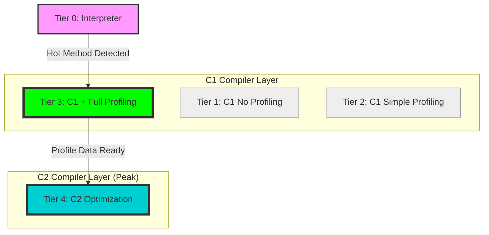

# Báo cáo Phân tích: JIT Tiered Compilation

## 1. Tổng quan về JIT (Just-In-Time)
JIT là bộ biên dịch của JVM giúp chuyển đổi Bytecode (`.class`) thành mã máy (`Native Code`) tại thời điểm thực thi (runtime). Thay vì thông dịch (interpret) từng dòng mã lặp đi lặp lại, JIT xác định các "điểm nóng" (hotspots) để biên dịch chúng một lần duy nhất sang mã máy nhằm tối ưu hiệu năng cực đại.

## 2. Mô hình Tiered Compilation (Biên dịch phân tầng)
Trong JVM hiện đại, quá trình biên dịch được chia làm 5 cấp độ (Tiers):

*Ghi chú: Các mũi tên thể hiện luồng tối ưu hóa phổ biến cho các "Hot Methods" mà bạn quan sát được (nhảy từ 0 thẳng lên 3 và 4).*

| Cấp độ (Tier) | Tên bộ biên dịch | Mục tiêu | Đặc điểm |
| :--- | :--- | :--- | :--- |
| **Tier 0** | Interpreter | Khởi động nhanh | Thông dịch trực tiếp Bytecode. Chậm nhưng thực thi ngay lập tức. |
| **Tier 1** | C1 (Client) | Tối ưu cơ bản | Biên dịch code đơn giản, không thu thập dữ liệu profile. |
| **Tier 2** | C1 (Client) | Tối ưu trung bình | Biên dịch với một chút dữ liệu profile. |
| **Tier 3** | **C1 + Full Profiling** | **Thu thập dữ liệu** | Biên dịch và gắn các bộ đếm (counters) để theo dõi số lần lặp, các nhánh if/else. |
| **Tier 4** | **C2 (Server)** | **Peak Performance** | Sử dụng dữ liệu profile từ Tier 3 để thực hiện các tối ưu cao cấp (Inlining, Escape Analysis). |

## 3. Tại sao chỉ thấy Tier 3 và Tier 4?
Đây là hiện tượng phổ biến khi bạn chạy một vòng lặp lớn (như tính số nguyên tố). Quy trình diễn ra như sau:

1.  **Giai đoạn đầu (Tier 0):** Khi bạn mới bắt đầu vòng lặp, JVM thông dịch code.
2.  **Giai đoạn nóng dần (Tier 3):** JVM nhận thấy hàm `isPrime` được gọi rất nhiều. Nó không tốn thời gian cho Tier 1 hay 2 mà nhảy thẳng lên **Tier 3**. Tại đây, C1 compiler biên dịch code để chạy nhanh hơn và quan trọng nhất là để **quan sát hành vi** của hàm.
3.  **Giai đoạn tối ưu hóa (Tier 4):** Sau khi đã có đủ dữ liệu từ Tier 3 (ví dụ: biết rằng các số chẵn luôn thoát sớm), **C2 compiler** sẽ ra tay. Nó tạo ra bản mã máy "hoàn hảo" nhất (Tier 4).
4.  **Chuyển giao:** Hệ thống sẽ chuyển sang dùng bản Tier 4 và bỏ qua bản Tier 3.

## 4. Giải mã các ký hiệu trong Log `-XX:+PrintCompilation`
Khi chạy file `run_phase1_issue1.bat`, bạn sẽ thấy các dòng log như:
` 150  456   3   com.nexus.phase1.JitAnalysis::isPrime (54 bytes)`

*   **150**: Thời gian (ms) kể từ khi JVM khởi động.
*   **456**: ID của tác vụ biên dịch.
*   **3**: Cấp độ biên dịch (Tier 3).
*   **54 bytes**: Kích thước của code bytecode (không phải mã máy).

## 5. Kết luận
Việc thấy Tier 3 và 4 chứng tỏ hàm của bạn đang được tối ưu hóa theo cách tối ưu nhất của JVM. Tier 3 là "mắt quan sát" và Tier 4 là "công cụ thực thi" tối thượng.

---
*Dữ liệu được phân tích tự động bởi Antigravity AI.*
