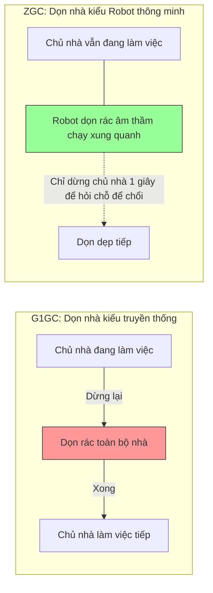

# Báo cáo So sánh: G1GC vs ZGC - Ai là "Vua" dọn rác?

## 1. Giới thiệu thí nghiệm
Trong phần này, chúng ta đã chạy cùng một chương trình `GcPressureDemo` (liên tục tạo và xóa các mảng byte 1MB) trên hai bộ dọn rác khác nhau với giới hạn bộ nhớ cực thấp (64MB) để xem chúng "ứng biến" thế nào.

## 2. Kết quả "soi" Log (Dữ liệu thực tế)

### A. G1GC (Garbage First) - "Lão tướng" bền bỉ
G1GC chia bộ nhớ ra thành nhiều ô nhỏ (Regions). Khi một ô đầy, nó sẽ dừng mọi thứ lại để dọn.

*   **Thời gian dừng (Pause Time)**: Thường dao động từ **1ms đến 2ms** trong thí nghiệm.
*   **Đặc điểm**: Bạn thấy log in ra rất nhiều đợt `Pause Young` và `Pause Remark`. Mỗi lần như vậy, ứng dụng của bạn bị "đứng hình" hoàn toàn trong chốc lát.
*   **Dòng log điển hình**: 
    `[0.213s][info][gc] GC(14) Pause Young (Concurrent Start) ... 1.032ms`

### B. ZGC (Z Garbage Collector) - "Chiến binh" tốc độ
ZGC là bộ dọn rác hiện đại nhất của Java. Nó thực hiện dọn dẹp theo kiểu "vừa chạy vừa dọn".

*   **Thời gian dừng (Pause Time)**: Cực kỳ ấn tượng, chỉ khoảng **0.007ms đến 0.040ms** (tức là chỉ vài chục micro giây).
*   **Đặc điểm**: ZGC dọn dẹp song song với ứng dụng. Nó không bắt app dừng lại lâu để quét bộ nhớ.
*   **Dòng log điển hình**:
    `[0.414s][info][gc,phases] GC(1) Pause Mark Start 0.007ms` (Nhanh đến mức người dùng không thể cảm nhận được).

---

## 3. Bảng so sánh dễ hiểu

| Tiêu chí | G1GC (Mặc định từ Java 9) | ZGC (Sẵn sàng từ Java 15) |
| :--- | :--- | :--- |
| **Cơ chế** | "Dừng hình" để quét rác (Stop-the-world). | "Vừa chạy vừa quét" (Concurrent). |
| **Độ trễ (Pause)** | Mili giây (1-100ms tùy Heap). | **Micro giây (< 1ms)** bất kể Heap to hay nhỏ. |
| **Sức chịu tải** | Rất tốt cho đa số ứng dụng web. | Cực tốt cho app cần phản hồi nhanh (Sàn chứng khoán, Game). |
| **Khi bộ nhớ hẹp** | Vẫn chạy tốt nhờ phân chia Region hiệu quả. | Dễ bị "Allocation Stall" (hụt hơi) vì cần không gian để dọn song song. |

---

## 4. Minh họa cơ chế bằng hình ảnh
Hãy tưởng tượng việc dọn nhà:

## 5. Khi nào GC được gọi? (Triggers)

JVM không dọn rác ngẫu nhiên mà tuân theo các quy luật sau:

1.  **Khi vùng nhớ đầy (Allocation Failure)**: 
    Đây là trường hợp phổ biến nhất. Khi bạn `new` một object mà vùng nhớ tương ứng (thường là Eden) không đủ chỗ, JVM buộc phải gọi GC để dọn đường cho object mới.
2.  **Khi các phân tầng (Generations) bị tràn**:
    - **Minor GC**: Xảy ra khi vùng Young Gen (nơi chứa đối tượng mới) bị đầy.
    - **Full GC**: Xảy ra khi vùng Old Gen (nơi chứa đối tượng sống lâu) bị đầy. Đây là đợt dọn dẹp "nặng nề" nhất.
3.  **Tiên đoán thông minh (Proactive/Adaptive)**:
    Các bộ GC hiện đại (G1, ZGC) theo dõi tốc độ bạn tạo ra object. Nếu thấy bộ nhớ "sắp" đầy, nó sẽ chủ động dọn dẹp trước để tránh việc ứng dụng bị dừng bất ngờ.
4.  **Metaspace đầy**:
    Khi nạp quá nhiều Class thông qua ClassLoader, vùng Metaspace có thể bị đầy, kích hoạt GC để dọn dẹp dữ liệu metadata của các Class không còn dùng.

---

## 6. Kết luận & Lời khuyên
*   Nếu bạn xây dựng một website bán hàng thông thường: **G1GC** là quá đủ và ổn định.
*   Nếu bạn xây dựng hệ thống Chat cho hàng triệu người hoặc Bot Trading: Hãy chuyển sang **ZGC** (`-XX:+UseZGC`) để trải nghiệm sự mượt mà tuyệt đối.
*   **Lưu ý quan trọng**: ZGC cần một chút "đất diễn" (Heap rộng hơn một chút) để nó có thể dọn dẹp âm thầm mà không làm phiền ứng dụng.

---
*Báo cáo được thực hiện bởi Antigravity AI - Nexus Java Internals Lab.*
