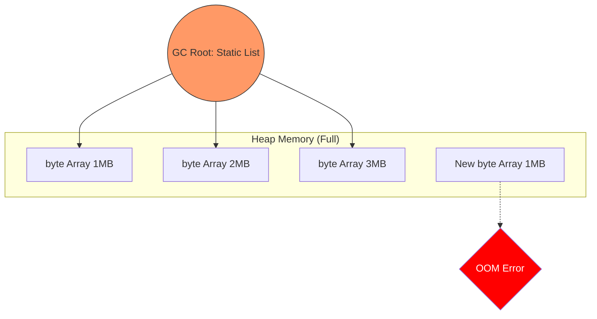

# Báo cáo Phân tích: Memory Leak & OutOfMemoryError (OOM)

## 1. Hiện tượng quan sát được
Khi chạy ứng dụng với giới hạn RAM **64MB** (`-Xmx64m`), chúng ta quan sát thấy log:
```text
Cấu hình JVM hiện tại (Heap size): 64 MB
Đã nhét: 10 MB | Bộ nhớ còn lại: 42 MB
Đã nhét: 20 MB | Bộ nhớ còn lại: 23 MB
Đã nhét: 30 MB | Bộ nhớ còn lại: 3 MB

!!! LỖI RỒI: Java heap space
java.lang.OutOfMemoryError: Java heap space
```

## 2. Phân tích nguyên nhân
Lỗi `OutOfMemoryError: Java heap space` xảy ra khi vùng nhớ Heap bị đầy và Garbage Collector (GC) không thể thu hồi thêm bất kỳ vùng nhớ nào để cấp phát cho đối tượng mới.

### Tại sao GC không dọn dẹp được?
Trong mã nguồn `MemoryLeakDemo.java`, chúng ta có dòng:
`private static final List<byte[]> leakedStorage = new ArrayList<>();`

*   **GC Root**: Biến `leakedStorage` là một biến `static`. Trong JVM, các biến static được coi là các "GC Roots" - chúng tồn tại suốt vòng đời của Class (thường là suốt vòng đời ứng dụng).
*   **Tham chiếu mạnh (Strong Reference)**: Mọi mảng `byte[]` khi được add vào List này đều được giữ bởi một tham chiếu mạnh. 
*   **Bất khả xâm phạm**: GC chỉ xóa những object nào "mất kết nối" với GC Roots. Vì List static vẫn còn đó và vẫn trỏ đến các mảng byte, GC buộc phải giữ chúng lại dù bộ nhớ đã cạn kiệt.



## 3. Bài học rút ra (Takeaways)

1.  **Cảnh giác với Static**: Tránh sử dụng các Collection (`List`, `Map`) dạng `static` để lưu trữ dữ liệu không giới hạn. Nếu bắt buộc phải dùng, hãy có cơ chế xóa (remove) hoặc sử dụng `WeakReference`.
2.  **Giám sát Heap**: Luôn hiểu rõ giới hạn `-Xmx` của ứng dụng. Nếu `-Xmx` quá nhỏ so với nhu cầu thực tế, app sẽ sập ngay cả khi không có leak.
3.  **Dấu hiệu nhận biết**: Trước khi sập OOM, CPU thường tăng rất cao (GC hoạt động liên tục nhưng không hiệu quả - hiện tượng GC Overhead Limit Exceeded).

---
*Báo cáo được lưu trữ để phục vụ cho việc so sánh các loại GC ở Issue #4.*
