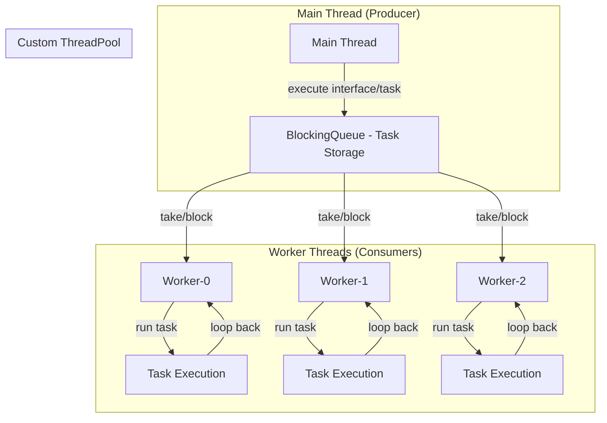

# Báo cáo Phân tích: Custom ThreadPool Implementation (Issue #6)

## 1. Tổng quan (Overview)
Trong Phase 3 này, chúng ta đã xây dựng một `CustomThreadPool` từ đầu mà không sử dụng các thư viện có sẵn của Java như `ExecutorService`. Mục tiêu là hiểu rõ cơ chế quản lý luồng, hàng đợi công việc và cách các Worker Threads duy trì sự sống.

## 2. Sơ đồ Kiến trúc (Architecture Diagram)



## 3. Các thành phần chính
- **BlockingQueue (taskQueue)**: Đóng vai trò là "kho chứa" các công việc (Runnable). Nó giúp điều phối giữa luồng gửi (Main thread) và luồng nhận (Worker threads).
- **WorkerThread**: Các luồng thực thi song song, lấy việc từ hàng đợi và chạy.
- **PoolSize**: Giới hạn số lượng luồng tối đa hoạt động cùng lúc để tối ưu tài nguyên.

## 3. Cơ chế hoạt động của Worker Thread
Một câu hỏi lớn trong Issue #6 là: *Làm thế nào Worker Thread không kết thúc sau khi xong một job?*

### Giải thích:
Thay vì chỉ thực thi code một lần rồi thoát, `WorkerThread` được thiết kế với một vòng lặp `while` vô hạn (hoặc cho đến khi shutdown):

```java
public void run() {
    while (!isShutdown || !taskQueue.isEmpty()) {
        Runnable task = taskQueue.take(); // (1)
        task.run();                        // (2)
    }
}
```

1. **Cơ chế Chặn (Blocking)**: Tại dòng `(1)`, phương thức `take()` của `BlockingQueue` sẽ chặn luồng nếu hàng đợi trống. Thread sẽ rơi vào trạng thái `WAITING` và không tiêu tốn CPU.
2. **Tái sử dụng (Reuse)**: Sau khi dòng `(2)` hoàn thành, vòng lặp `while` sẽ quay lại dòng `(1)` để chờ lấy task mới. Điều này giúp hệ thống không phải tốn chi phí khởi tạo lại Thread mới (một thao tác rất "đắt" trong Java truyền thống).

## 4. Kết quả thực nghiệm
Khi chạy `ThreadPoolDemo` với 3 workers và 10 tasks, kết quả log cho thấy sự luân phiên:

```text
CustomWorker-0 is executing task...
Processing Task #1 on thread: CustomWorker-0
CustomWorker-1 is executing task...
Processing Task #2 on thread: CustomWorker-1
CustomWorker-2 is executing task...
Processing Task #3 on thread: CustomWorker-2
...
CustomWorker-0 finished task.
CustomWorker-0 is executing task... (Lấy task tiếp theo thay vì kết thúc)
```

## 5. Kết luận
- **Tính kiểm soát**: Chúng ta có thể kiểm soát chính xác số lượng luồng hoạt động thông qua tham số `poolSize`.
- **Hiệu suất**: Tiết kiệm tài nguyên nhờ việc tái sử dụng luồng và cơ chế chờ của `BlockingQueue`.
- **An toàn**: Việc sử dụng `BlockingQueue` giúp giải quyết bài toán Producer-Consumer một cách an toàn mà không cần code `synchronized` thủ công phức tạp.
