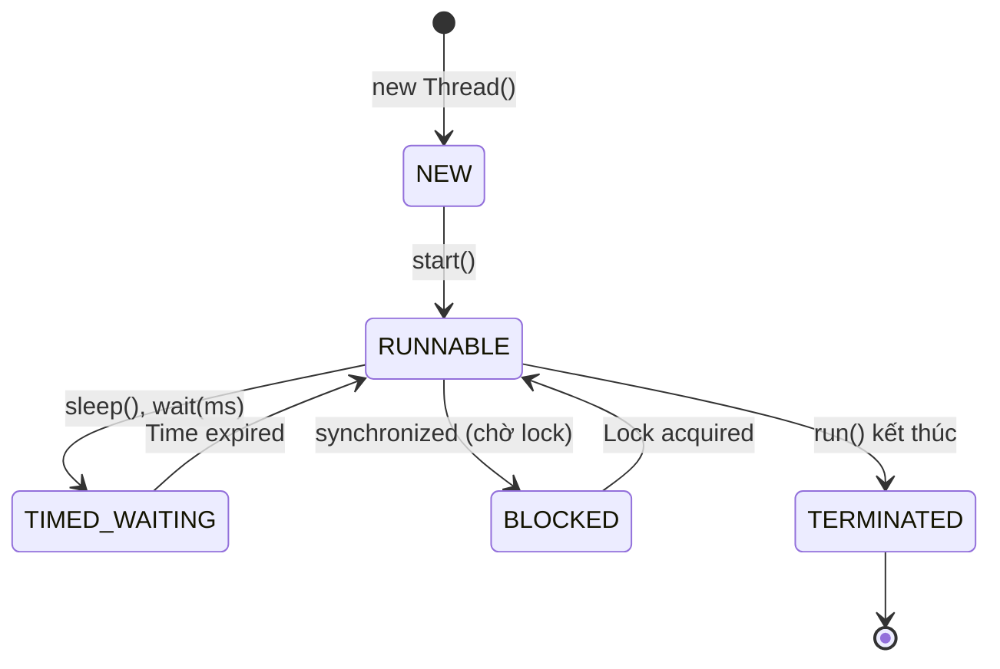

# Báo cáo: Nhập môn Concurrency & Thread Lifecycle

## 1. Tổng quan về Thread (Luồng)
Trong Java, một Thread (luồng) là một đơn vị thực thi nhỏ nhất của tiến trình. Việc sử dụng đa luồng giúp ứng dụng tận dụng sức mạnh của CPU nhiều nhân, xử lý các tác vụ song song.

## 2. Vòng đời của một Thread (Thread States)

Dựa trên thực hành `ThreadLifecycleDemo`, chúng ta quan sát được các trạng thái sau:

### A. NEW
Thread vừa được tạo bằng từ khóa `new Thread(...)` nhưng chưa chạy. Nó mới chỉ là một đối tượng Java bình thường trên Heap, chưa có tài nguyên hệ điều hành.

### B. RUNNABLE
Sau khi gọi `start()`. Thread đã được đăng ký với bộ lập lịch của Hệ điều hành (OS Scheduler). Nó có thể đang chạy hoặc đang chờ CPU cấp thời gian thực thi.

### C. TIMED_WAITING (Ngủ có báo thức)
Thread tạm dừng làm việc trong một khoảng thời gian xác định (ví dụ: `Thread.sleep(1000)`). 
- **Đặc điểm**: Tự nguyện và chủ động. Hệ thống biết khi nào nó sẽ tỉnh lại.

### D. TERMINATED
Thread đã hoàn thành công việc hoặc bị lỗi văng Exception và dừng lại. Nó không thể "sống lại" (start lần 2).

### Sơ đồ Vòng đời Thread

---

## 3. Trạng thái BLOCKED - "Nút thắt cổ chai" (Bottleneck)

Mặc dù không xuất hiện trong demo đơn giản, **BLOCKED** là trạng thái cực kỳ quan trọng cần lưu ý:

*   **Định nghĩa**: Một Thread muốn đi vào vùng được bảo vệ (`synchronized`) nhưng vùng đó đang bị một Thread khác chiếm giữ.
*   **So sánh với TIMED_WAITING**:
    - `TIMED_WAITING`: Ngủ do mình muốn (biết khi nào dậy).
    - `BLOCKED`: Đợi do người khác bắt buộc (không biết khi nào được chạy).

### Tại sao BLOCKED gây hại cho hệ thống?
1.  **Lãng phí CPU**: Thread đứng đợi nhưng vẫn tiêu tốn bộ nhớ (Stack) và làm tăng chi phí quản lý của OS.
2.  **Lock Contention**: Nếu hàng trăm luồng cùng BLOCKED bởi một khóa (Lock) duy nhất, app sẽ bị treo cứng (Deadlock) hoặc chạy cực kỳ chậm.
3.  **Hết tài nguyên**: Trong các server như Tomcat, nếu tất cả các luồng xử lý request đều bị BLOCKED, server sẽ từ chối các kết nối mới (Connection Refused).

---
*Báo cáo được thực hiện bởi Antigravity AI - Hướng dẫn nhập môn đa luồng.*
