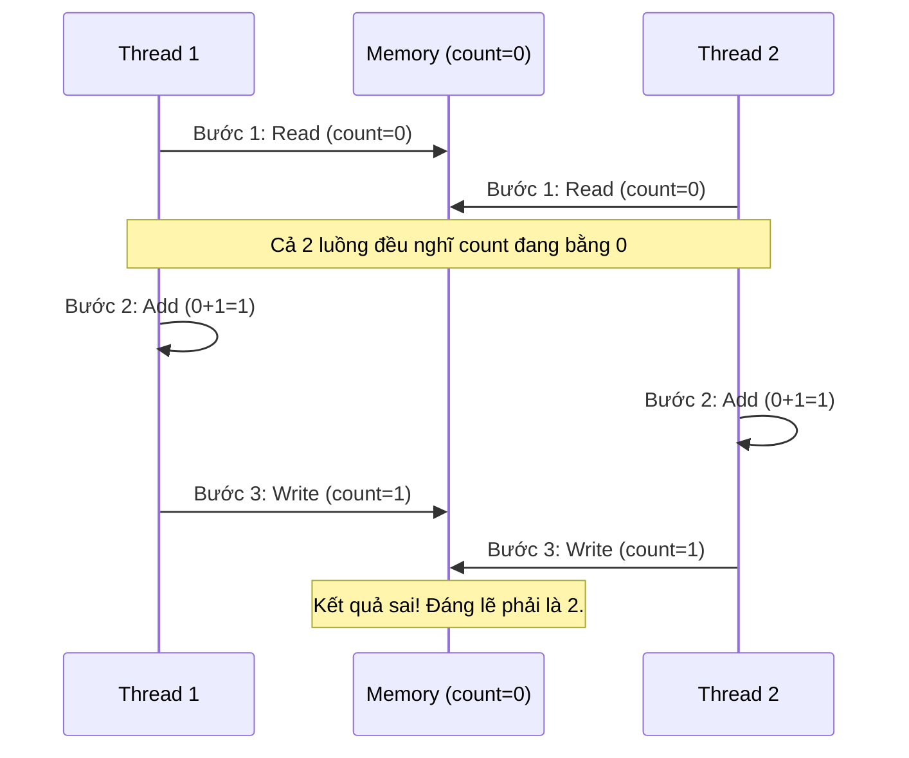
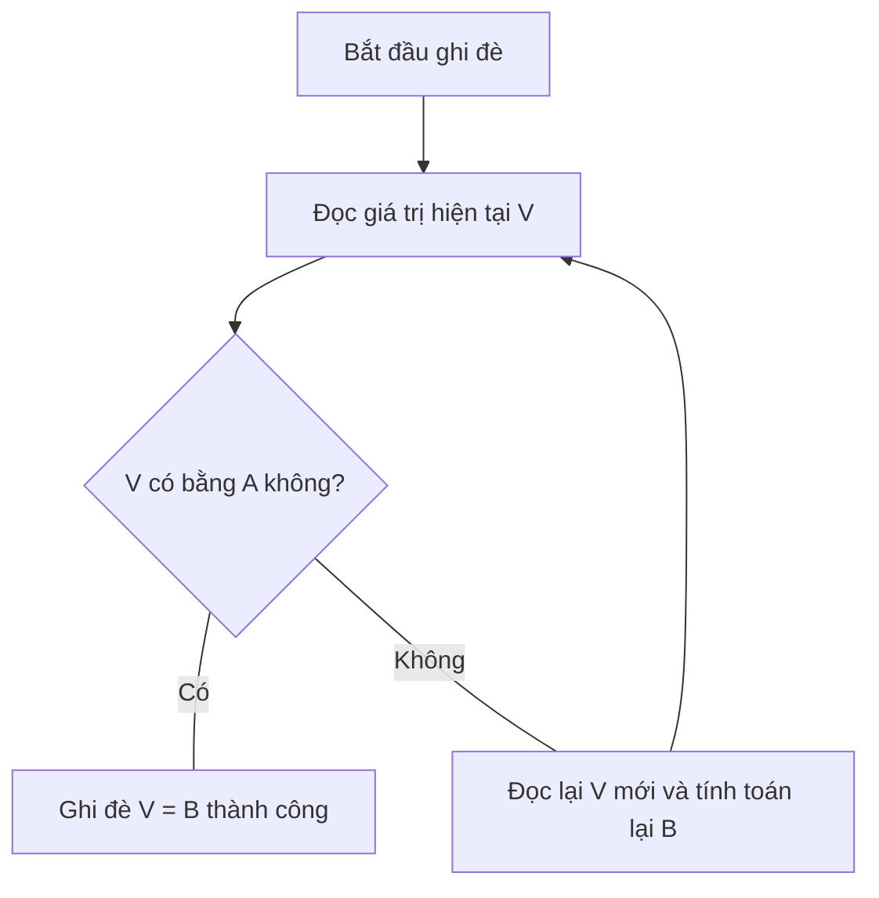

# Issue #5: Race Condition & Atomic Synchronization Strategy

## 1. Vấn đề: Race Condition là gì?
Race Condition (Điều kiện tranh đua) xảy ra khi nhiều luồng cùng truy cập và thay đổi một dữ liệu dùng chung (shared data) tại cùng một thời điểm. Kết quả cuối cùng phụ thuộc vào việc luồng nào "chạy nhanh hơn" và ghi đè dữ liệu của luồng kia.

### Tại sao `count++` không an toàn?
Lệnh `count++` nhìn rất đơn giản nhưng thực tế JVM thực hiện qua 3 bước (Non-atomic):
1.  **Read**: Đọc giá trị hiện tại của `count` từ bộ nhớ vào thanh ghi CPU.
2.  **Add**: Cộng thêm 1 vào giá trị trong thanh ghi.
3.  **Write**: Ghi giá trị mới từ thanh ghi trở lại bộ nhớ.

### Sơ đồ minh họa lỗi:

## 2. Các chiến lược giải quyết

### A. Sử dụng `synchronized` (Lock-based)
Dùng từ khóa `synchronized` để đảm bảo tại một thời điểm chỉ có DUY NHẤT một luồng được thực hiện code bên trong. 
- **Ưu điểm**: Dễ hiểu, an toàn tuyệt đối.
- **Nhược điểm**: Hiệu năng thấp nếu nhiều luồng tranh chấp (gây trạng thái **BLOCKED**).

### B. Sử dụng `AtomicInteger` (Lock-free)
Dựa trên cơ chế **CAS (Compare-And-Swap)** của CPU. Nó không khóa luồng mà thử thực hiện ghi đè, nếu thấy dữ liệu đã bị thay đổi bởi luồng khác, nó sẽ tự động thử lại (Retry).
- **Ưu điểm**: Hiệu năng cực cao, không làm thread bị dừng lại (Blocked).
- **Nhược điểm**: Chỉ dùng được cho các biến đơn lẻ.

## 4. Cơ chế CAS (Compare and Swap) hoạt động như thế nào?

CAS là một kỹ thuật **Lạc quan (Optimistic Locking)**. Nó hoạt động dựa trên 3 thông số:
1.  **V (Value)**: Giá trị thực tế trong bộ nhớ.
2.  **A (Expected)**: Giá trị mà luồng "nghĩ" là đang có.
3.  **B (New)**: Giá trị mới muốn cập nhật.

**Thuật toán:**
- Nếu `V == A`: Cập nhật `V = B` (Thành công).
- Nếu `V != A`: Hủy bỏ và đọc lại giá trị `V` mới để thử lại (Retry).

## 5. Kết quả thực nghiệm (`RaceConditionDemo`)
Khi chạy với 100 luồng, mỗi luồng tăng 10,000 lần:
- **Expected**: 1,000,000
- **Unsafe Counter**: ~950,000 (Sai số do các luồng ghi đè nhau).
- **Atomic Counter**: 1,000,000 (Chính xác).
- **Sync Counter**: 1,000,000 (Chính xác).

---
*Báo cáo được thực hiện bởi Antigravity AI - Nexus Java Internals Lab.*
