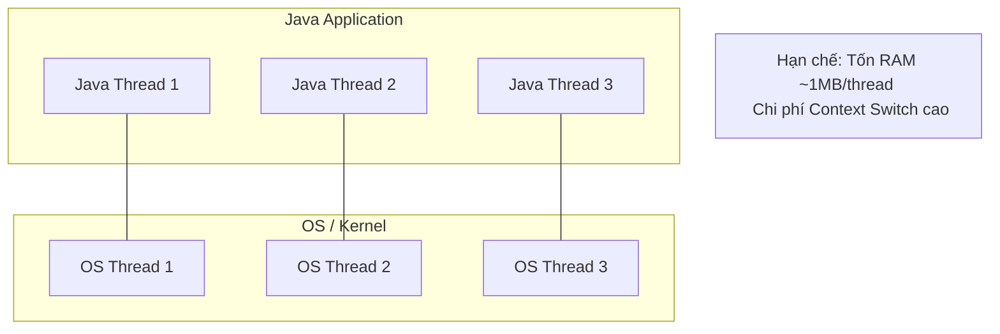
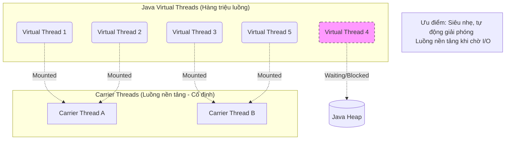

# Báo cáo Phân tích: Virtual Threads & Scalability (Issue #7)

## 1. Khái niệm Virtual Threads (Java 21+)
Virtual Threads (luồng ảo) là các luồng có trọng lượng cực nhẹ, được quản lý bởi Java Runtime thay vì hệ điều hành (OS). 

### Carrier Threads vs Virtual Threads
- **Carrier Threads (Luồng nền tảng)**: Là các Platform Threads thực thụ của OS. JVM quản lý một pool các carrier threads này (thường bằng số nhân CPU).
- **Virtual Threads (Luồng ảo)**: "Chạy" bên trên carrier threads. Khi một luồng ảo gặp các thao tác chặn (Blocking I/O, sleep), JVM sẽ "treo" luồng ảo đó và giải phóng carrier thread để chạy luồng ảo khác.

## 2. So sánh Kiến trúc (Architecture Comparison)

### A. Mô hình Truyền thống (Platform Threads - 1:1)
Mỗi luồng Java tương ứng trực tiếp với một luồng của Hệ điều hành (OS Thread).

### B. Mô hình Hiện đại (Virtual Threads - M:N)
Nhiều luồng ảo (M) chạy trên một số ít luồng nền tảng (N).

## 2. Kết quả Thí nghiệm (10,000 Tasks)
Qua thử nghiệm thực tế trên hệ thống với 10,000 tasks (mỗi task sleep 1s):

| Đặc điểm | Platform Threads (Pool 1,000) | Virtual Threads (Per-task) |
| :--- | :--- | :--- |
| **Thời gian hoàn thành** | **10,222 ms** (~10.2 giây) | **1,289 ms** (~1.3 giây) |
| **Chi phí luồng** | Phải chia thành 10 đợt xử lý | Xử lý gần như song song hoàn toàn |
| **Khả năng mở rộng** | Bị giới hạn bởi pool size | Hàng vạn luồng ảo cùng chạy |
| **Hiệu quả (Throughput)** | Thấp (do chờ đợi đồng bộ) | Rất cao (khai thác tối đa thời gian chờ) |

## 3. Tại sao Virtual Threads scale nhanh hơn?
1. **Trọng lượng nhẹ**: Stack của Virtual Thread được lưu trữ trong Heap và có thể thay đổi kích thước linh hoạt, thay vì cấp phát cố định 1MB như Platform Thread.
2. **Non-blocking at OS level**: Khi `Thread.sleep()` được gọi trong Virtual Thread, nó không làm treo luồng OS. JVM chỉ đơn giản là đổi context cho luồng ảo khác làm việc.
3. **Chi phí Context Switch thấp**: Việc đổi context giữa các luồng ảo diễn ra trong không gian người dùng (User space), nhanh hơn nhiều so với việc kernel thực hiện context switch cho Platform Threads.

## 4. Kết luận
Virtual Threads không sinh ra để chạy nhanh hơn (về tốc độ CPU), mà để mang lại **độ lợi (throughput)** cao hơn cho ứng dụng vốn dành phần lớn thời gian chờ đợi I/O (như Web Server).
