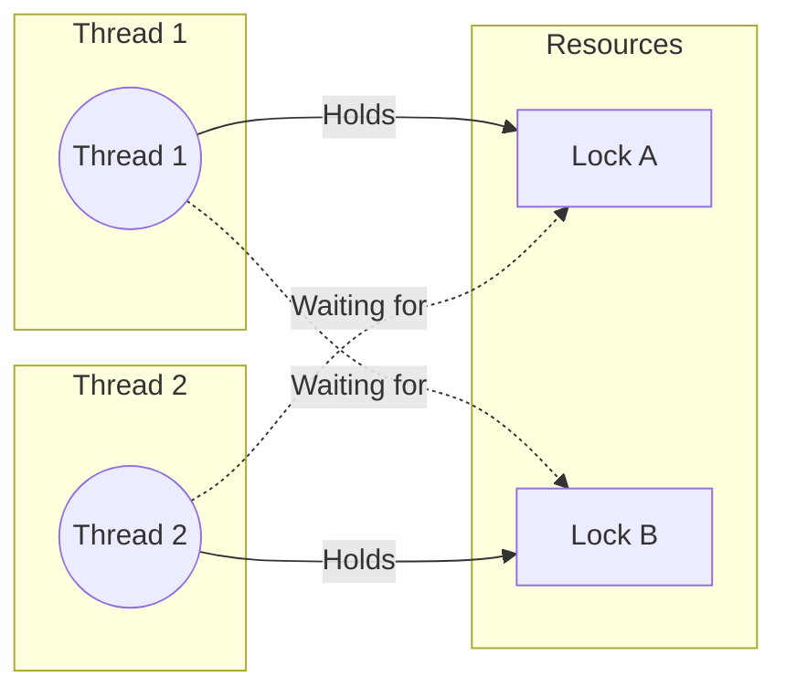

# Báo cáo Phân tích: Deadlock & Thread Dump (Issue #8)

## 1. Deadlock là gì?
Deadlock (Khóa chết) xảy ra khi hai hoặc nhiều luồng bị treo vĩnh viễn, mỗi luồng chờ đợi một tài nguyên mà luồng kia đang nắm giữ.

### Kịch bản trong DeadlockDemo:



- **Thread 1**: Chiếm LockA -> Chờ LockB.
- **Thread 2**: Chiếm LockB -> Chờ LockA.
=> Cả hai luồng sẽ tạo thành một vòng lặp chờ đợi (Circular Wait).

## 2. Cách phát hiện Deadlock bằng Thread Dump
Khi ứng dụng bị treo, chúng ta có thể sử dụng công cụ `jstack` đi kèm với JDK để "chụp ảnh" trạng thái của tất cả các luồng tại thời điểm đó.

### Các bước thực hiện:
1. Chạy chương trình `run_phase4_issue8.bat`.
2. Mở một terminal mới.
3. Chạy `jps -l` để tìm mã định danh quy trình (PID) của `DeadlockDemo`.
4. Chạy `jstack <PID>`.

## 3. Phân tích Thread Dump Thực tế
Dưới đây là kết quả trích xuất từ `jstack` khi chạy `DeadlockDemo`:

```text
Found one Java-level deadlock:
=============================
"Deadlock-Thread-1":
  waiting to lock monitor 0x... (object 0x000000063ee106b0, a java.lang.Object),
  which is held by "Deadlock-Thread-2"

"Deadlock-Thread-2":
  waiting to lock monitor 0x... (object 0x000000063ee106a0, a java.lang.Object),
  which is held by "Deadlock-Thread-1"
```

### Chi tiết Stack Trace gây lỗi:
- **Deadlock-Thread-1**: Đang bị kẹt tại dòng `DeadlockDemo.java:22` khi cố gắng lấy khóa của `LockB`. Nó hiện đang giữ `LockA`.
- **Deadlock-Thread-2**: Đang bị kẹt tại dòng `DeadlockDemo.java:33` khi cố gắng lấy khóa của `LockA`. Nó hiện đang giữ `LockB`.

### Trạng thái luồng:
Cả hai luồng đều ở trạng thái **`BLOCKED (on object monitor)`**. Điều này xác nhận rằng các luồng không phải đang chạy tác vụ nặng mà đang dừng hẳn để chờ khóa.

## 4. Bài học rút ra
1. **Thứ tự ưu tiên khóa**: Luôn cố gắng chiếm các khóa theo một thứ tự nhất định (ví dụ luôn lấy LockA trước LockB ở tất cả các luồng).
2. **Sử dụng Timeout**: Thay vì `synchronized`, có thể dùng `ReentrantLock.tryLock(timeout)` để tự giải phóng nếu không lấy được khóa sau một thời gian.
3. **Giảm phạm vi khóa**: Chỉ khóa những đoạn code thực sự cần thiết để giảm xác suất tranh chấp.
