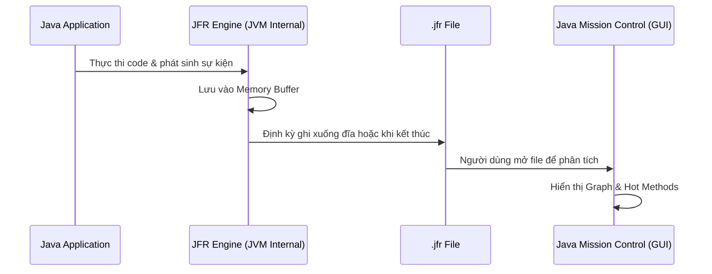
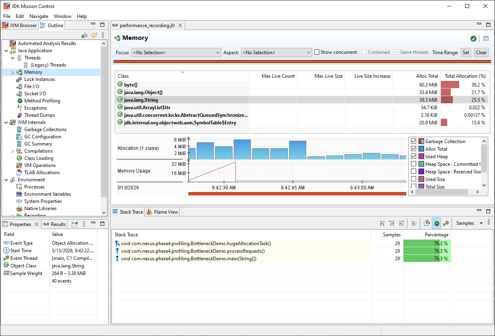
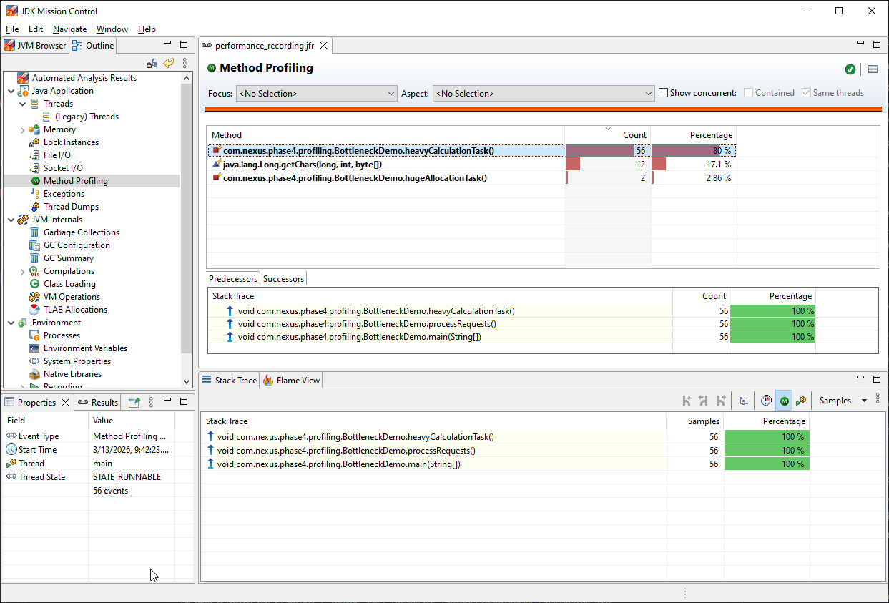

# Phân tích Hiệu năng với JFR & JMC (Issue #9)

## 1. Giới thiệu về JFR (Java Flight Recorder)
Java Flight Recorder là một công cụ phân tích sự kiện được tích hợp sẵn trong JVM. Khác với Profiling thông thường (dựa trên Sampling), JFR có chi phí cực thấp (overhead < 1%) và thu thập dữ liệu ở tầng sâu của JVM.

### Quy trình phân tích:

## 2. Các loại "Nút thắt cổ chai" (Bottlenecks) trong Demo
Trong `BottleneckDemo.java`, chúng ta đã tạo ra 3 loại tác vụ:
1. **`fastTask()`**: Mô phỏng xử lý thông thường, tiêu tốn ít tài nguyên.
2. **`heavyCalculationTask()`**: 
   - **Triệu chứng**: Chiếm dụng CPU cao (Hot Method).
   - **Phát hiện**: Trong JMC, tab "Method Profiling" hoặc "Call Tree" sẽ chỉ ra hàm này chiếm tỉ lệ % mẫu cao nhất.
3. **`hugeAllocationTask()`**:
   - **Triệu chứng**: Gây áp lực lên bộ nhớ tạm và làm GC phải chạy liên tục (Allocation Pressure).
   - **Phát hiện**: JMC tab "Memory" -> "Allocation" sẽ chỉ ra class `java.lang.String` hoặc `StringBuilder` được khởi tạo quá mức tại hàm này.

### A. Biểu đồ Bộ nhớ (Heap Usage) & Allocation
Quan sát Tab **Memory**, dữ liệu thực tế cho thấy:
- **Hàm gây áp lực**: `hugeAllocationTask()` chịu trách nhiệm cho **76.3%** lượng object được tạo ra.
- **Đối tượng rác**: `java.lang.String` chiếm tỉ lệ cao nhất (**25.5%**).
- **Hình thái**: Biểu đồ Used Heap răng cưa minh chứng cho việc Garbage Collector phải làm việc liên tục để dọn dẹp lượng String khổng lồ này.

### B. Hot Methods (CPU Bottleneck)
Tại Tab **Method Profiling**, kết quả phân tích chỉ dịch danh:
- **Hàm ngốn CPU**: `heavyCalculationTask()` chiếm đến **80%** tổng số mẫu ghi được.
- **Nguyên nhân**: Thực hiện vòng lặp 1 triệu phép tính Pow liên tục trong mỗi request.
- **Stack Trace**: `main` -> `processRequests` -> `heavyCalculationTask`.

## 4. Tổng kết quan sát
Việc kết hợp sơ đồ đường răng cưa của Heap và bảng thống kê Hot Methods giúp chúng ta có cái nhìn toàn diện về sức khỏe của JVM mà không cần phải debug từng dòng code.

## 5. Cách thực hiện phân tích
1. Chạy tệp `run_phase4_issue9.bat`.
2. Đợi khoảng 1 phút để JFR thu thập đủ dữ liệu thực tế.
3. Mở tệp `docs/performance_recording.jfr` bằng **Java Mission Control (JMC)**.
4. **Kiểm tra CPU**: Tìm mục "Method Profiling" để thấy các hàm ngốn CPU nhất.
5. **Kiểm tra Memory**: Tìm mục "TLAB" hoặc "Allocation" để thấy áp lực tạo object.

## 6. Ưu điểm của JFR so với Profiler truyền thống
- **Low Overhead**: Có thể bật ngay trên Production mà không làm chậm hệ thống.
- **Deep Visibility**: Thấy được cả các sự kiện của JVM như: Safepoints, Class Loading, JIT Compilation, và các hoạt động của GC.
- **Always-on**: Có thể cấu hình để luôn ghi dữ liệu, giúp truy vết nguyên nhân gây treo app ngay cả khi sự cố đã xảy ra trong quá khứ.
