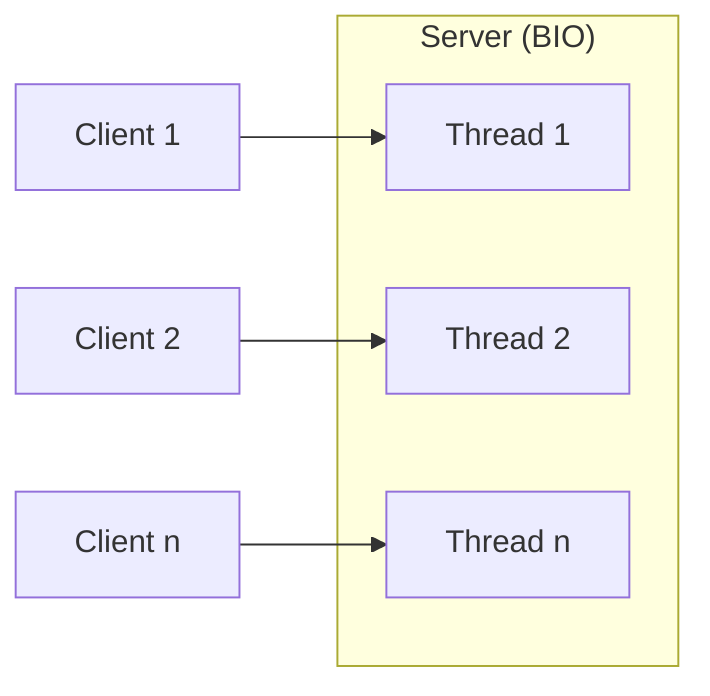
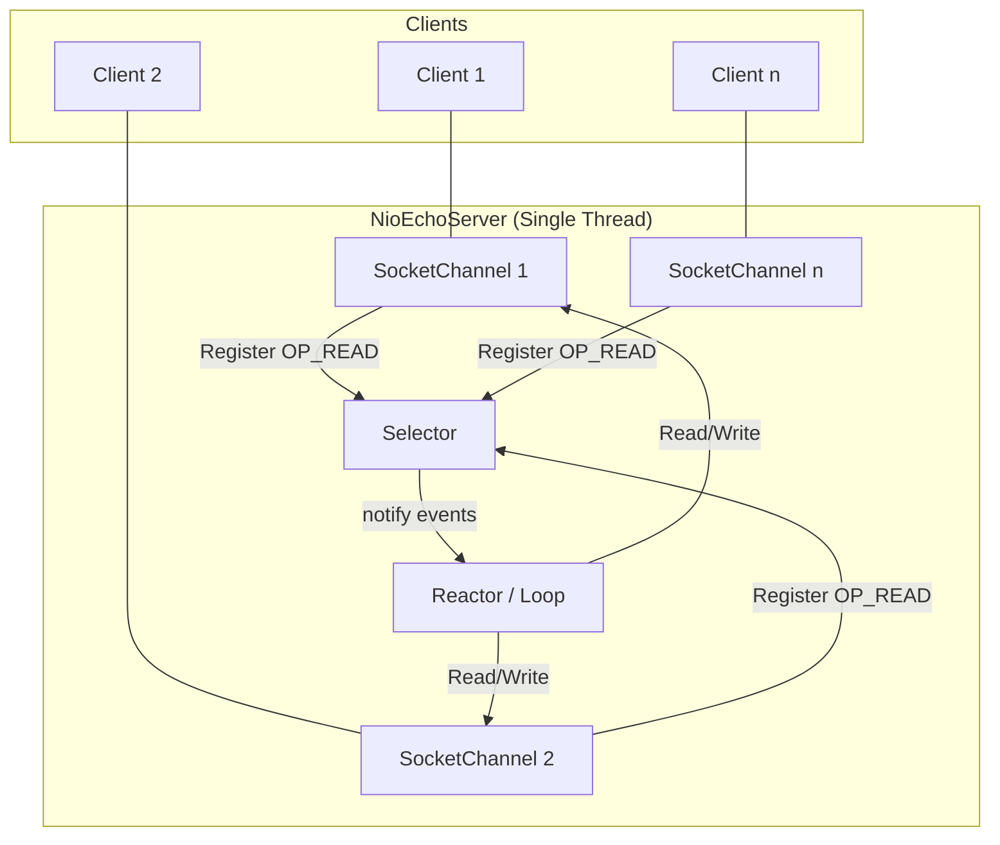
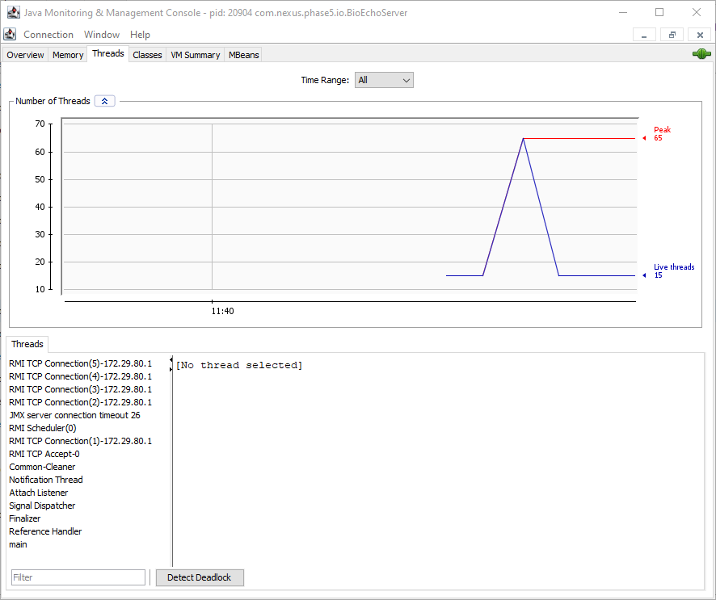
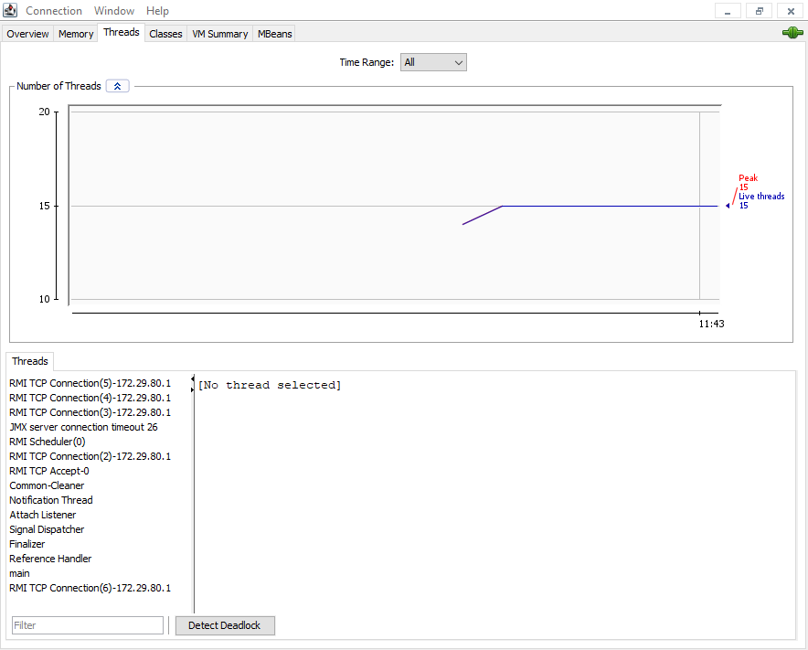

# Báo cáo Phân tích: NIO Selector & High-Performance I/O (Issue #10)

## 1. Blocking I/O (BIO) vs Non-blocking I/O (NIO)

Trước khi Java 1.4 ra đời, chúng ta chỉ có BIO. Điểm khác biệt lớn nhất nằm ở cách quản lý luồng (Threads):

| Đặc điểm | BIO (Blocking I/O) | NIO (Non-blocking I/O) |
| :--- | :--- | :--- |
| **Mô hình** | One Thread per Connection | One Thread for Many Connections |
| **Cơ chế** | Luồng bị đứng im (Block) khi chờ dữ liệu | Luồng rảnh tay để làm việc khác khi chưa có dữ liệu |
| **Khả năng mở rộng** | Kém (Tốn nhiều RAM cho Stack Thread) | Rất cao (Hàng vạn kết nối chỉ với vài luồng) |
| **Độ phức tạp** | Đơn giản, dễ viết | Phức tạp, cần quản lý Selector/Buffer |

### Sơ đồ BIO (Mỗi kết nối một luồng):


## 2. Tổng quan về kiến trúc Non-blocking I/O (NIO)

### Sơ đồ cơ chế hoạt động:



## 2. Các thành phần cốt lõi trong Lab
- **ServerSocketChannel**: Một kênh lắng nghe các kết nối TCP từ client (thay thế ServerSocket).
- **SocketChannel**: Kênh giao tiếp thực tế giữa server và một client cụ thể.
- **Selector**: "Người điều phối" thông minh. Luồng sẽ hỏi Selector: "Có kênh nào đang sẵn sàng để đọc/ghi không?".
- **SelectionKey**: Bản ghi đăng ký giữa một Channel và một Selector, chứa thông tin về loại sự kiện (Accept, Read, Write).

## 3. Kết quả thực nghiệm (NioLoadTester)
Khi chạy `NioLoadTester` với **100 kết nối đồng thời**:

- **Kết quả**: Server xử lý mượt mà toàn bộ 100 kết nối chỉ bằng **1 luồng duy nhất**.
- **Quan sát Log**:
    - Các sự kiện `[ACCEPT]` và `[READ]` diễn ra xen kẽ nhau linh hoạt. 
    - Server không cần khởi tạo thêm bất kỳ thread mới nào.
- **Tiết kiệm tài nguyên**: Nếu dùng BIO truyền thống, chúng ta sẽ tốn ít nhất 100 luồng (~100MB RAM chỉ riêng cho Stack). Với NIO, chi phí RAM cho 100 kết nối là không đáng kể.

## 4. So sánh thực tế qua JConsole (Visual Evidence)

Dưới đây là hình ảnh so sánh số lượng luồng (Threads) thực tế được chụp từ **JConsole** khi chạy Load Test:

### BIO (Blocking I/O): Thread per Connection
Khi chạy 50 client, số lượng Threads tăng vọt (Peak: 65 threads). Biểu đồ có hình răng cưa dốc đứng, phản ánh việc mỗi client "ép" JVM phải sinh thêm một luồng mới.



### NIO (Non-blocking I/O): One Thread for all
Duy trì số lượng luồng ở mức tối thiểu và ổn định (Peak: 15 threads - chủ yếu là các luồng hệ thống). Biểu đồ đi ngang, chứng minh dù có bao nhiêu kết nối thì gánh nặng về Thread vẫn không thay đổi.



## 5. Những lưu ý kỹ thuật (Gặt hái từ Lab)

### A. Tầm quan trọng của `iter.remove()`
Trong vòng lặp xử lý sự kiện:
```java
Iterator<SelectionKey> iter = selectedKeys.iterator();
while (iter.hasNext()) {
    SelectionKey key = iter.next();
    iter.remove(); // BẮT BUỘC
    ...
}
```
Nếu thiếu dòng `iter.remove()`, Selector sẽ tiếp tục báo cáo sự kiện đó ở vòng lặp tiếp theo dù nó đã được xử lý, dẫn đến CPU tăng cao hoặc lỗi logic.

### B. Flip and Rewind (ByteBuffer)
`ByteBuffer` là công cụ duy nhất để truyền dữ liệu trong NIO. Chúng ta phải làm chủ trạng thái của nó:
- `buffer.flip()`: Chuyển từ Ghi (nhận từ client) sang Đọc (để server xử lý).
- `buffer.clear()`: Xóa sạch để dùng lại cho đợt dữ liệu tiếp theo.

## 5. Kết luận
NIO Selector là nền tảng của các Web Server hiện đại (như Netty, Tomcat NIO). Nó giúp hệ thống mở rộng (Scale) tới hàng chục vạn kết nối mà không làm quá tải hệ điều hành bởi số lượng luồng quá lớn.

---
*Báo cáo được thực hiện bởi Antigravity AI - Nexus Java Internals Lab (Phase 5).*
